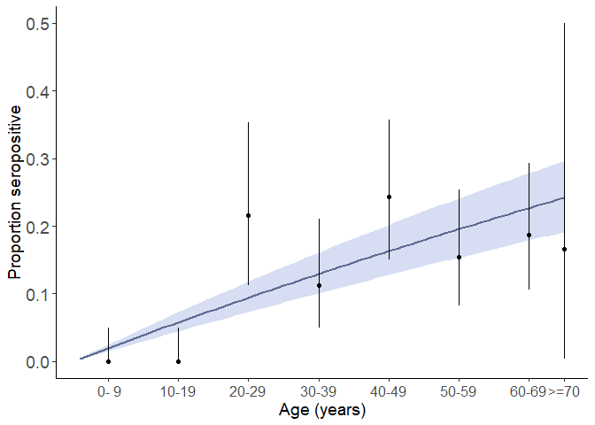
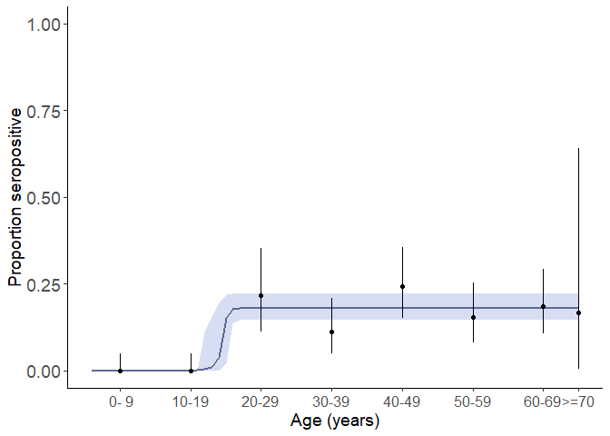

<!-- README.md is generated from README.Rmd. Please edit that file -->
Rsero: Estimate the annual force of infection using serological data
====================================================================

Rsero is R package dedicated to the implementation of serocatalytic models that are used to estimate the force of infection from age-stratified serological surveys.

Estimations requires:
- The age of each individual

-   Their seropositivity status

-   The year of sampling

-   A model of pathogen circulation

The package provides a standardized framework to store serological data, analyze serological surveys, use a variety of serocatalytic models, run MCMC algorithm to estimate the parameters of the force of infection, and analyse the results.

Installation
------------

To install the package, type

``` r
devtools::install_github("nathoze/Rsero")
```

(This step requires that the package *devtools* is installed). Installation may take a few minutes due to the compilation of the stan files that encode the serocatalytic models.

MCMC simulations are done using the package rstan, that requires Rtools 3.3 on Windows computers. Rtools 3.3 can be found here <https://cran.r-project.org/bin/windows/Rtools/>

More details
------------

More details on the functions can be found in the documentation. The serocatalytic models are described in details in the vignette *models*. This vignette includes several examples and shows the different features of the packages.

Working with serological data
-----------------------------

One of the feature of *Rsero* is to store serological data in a standard format to permit some estimations and fit with serocatalytic models. A serological survey contains primarily the age and seropositivity status of the individuals, and can also contain information such as the sex, the location and the year of sampling, categories of individuals that ahave different risk of exposure ...

Let's work on a toy example with simulated data: 500 individuals aged 1 to 70 yo, with a probability of infection of 0.2.

    #> Warning: package 'Rcpp' was built under R version 3.3.3
    #> Warning: package 'corrplot' was built under R version 3.3.3
    #> Warning: package 'ggplot2' was built under R version 3.3.3
    #> Warning: package 'binom' was built under R version 3.3.3
    #> Warning: package 'bayesplot' was built under R version 3.3.3
    #> Warning: package 'rstan' was built under R version 3.3.3
    #> Warning: package 'StanHeaders' was built under R version 3.3.3
    #> Warning: package 'rstantools' was built under R version 3.3.3
    #> Warning: package 'shinystan' was built under R version 3.3.3
    #> Warning: package 'shiny' was built under R version 3.3.3
    #> Warning: package 'httpuv' was built under R version 3.3.3

Now we write these data as a *SeroData*, the type of data used in the package

That's the minimum requirement for creating a *SeroData* and it can be already used for the model fit. However we can still enter more information about the survey. Suppose the first 250 are males, the last 250 are females, that they were all sampled in 2015 in Paris.

Some basic analysis can be done on this dataset. The seroprevalence is obtained by calling the function *seroprevalence* and the age-profile of seroprevalence by calling *seroprevalence.plot*

``` r
seroprevalence(simulated.survey)
#> [1] "Mean: 0.16    2.5%: 0.13    97.5%: 0.2"
seroprevalence.plot(simulated.survey,YLIM=0.3)
#> [1] "Category: 1"
#> [[1]]
#> Warning: Removed 1 rows containing missing values (geom_point).
#> Warning: Removed 1 rows containing missing values (geom_segment).
```


If for instance we want to estimate different values of the force of infection for males and females, the variable *category* has to be defined:

Example.
--------

In this example we show the basic steps to follow to get a complete analysis of a serological survey. This analysis uses a simulated dataset containing samples of 500 individuals.

The data is saved under a custom format *SeroData*, that stores information about the serological surveys and details on the participants. Basic information such as the seroprevalence can be obtained simply by typing

``` r
seroprevalence(one_peak_simulation)
#> [1] "Mean: 0.11    2.5%: 0.09    97.5%: 0.15"
```

and a graph of the age profile of seroprevalence is obtained using

``` r
seroprevalence.plot(one_peak_simulation)
#> [1] "Category: 1"
#> [[1]]
```


Age-stratified serological surveys assess immunological markers of past infections and can be used to reconstruct the historical patterns of the circulation of an infectious disease and the force of infection (the per capita rate at which susceptible individuals will be infected a given year). Such inference is performed using serocatalytic models. The Rsero package proposes several models that can be fitted to the data using the command

``` r
FOIfit = fit( data = one_peak_simulation,  model = seromodel)
```

In its basic form a model is defined by specifying the mode of circulation of the pathogen. The simplest type of model assumes a constant force of infection. We define it with the command

``` r
ConstantModel = FOImodel(type = 'constant')
```

We can now fit the defined model to the data:

``` r
FOIfit.constant = fit( data = one_peak_simulation,  model = ConstantModel, chains=1)
#> 
#> SAMPLING FOR MODEL 'intervention' NOW (CHAIN 1).
#> Rejecting initial value:
#>   Log probability evaluates to log(0), i.e. negative infinity.
#>   Stan can't start sampling from this initial value.
#> 
#> Gradient evaluation took 0.008 seconds
#> 1000 transitions using 10 leapfrog steps per transition would take 80 seconds.
#> Adjust your expectations accordingly!
#> 
#> 
#> Iteration:    1 / 5000 [  0%]  (Warmup)
#> Iteration:  500 / 5000 [ 10%]  (Warmup)
#> Iteration: 1000 / 5000 [ 20%]  (Warmup)
#> Iteration: 1500 / 5000 [ 30%]  (Warmup)
#> Iteration: 2000 / 5000 [ 40%]  (Warmup)
#> Iteration: 2500 / 5000 [ 50%]  (Warmup)
#> Iteration: 2501 / 5000 [ 50%]  (Sampling)
#> Iteration: 3000 / 5000 [ 60%]  (Sampling)
#> Iteration: 3500 / 5000 [ 70%]  (Sampling)
#> Iteration: 4000 / 5000 [ 80%]  (Sampling)
#> Iteration: 4500 / 5000 [ 90%]  (Sampling)
#> Iteration: 5000 / 5000 [100%]  (Sampling)
#> 
#>  Elapsed Time: 3.175 seconds (Warm-up)
#>                2.344 seconds (Sampling)
#>                5.519 seconds (Total)
#> Warning: There were 1562 divergent transitions after warmup. Increasing adapt_delta above 0.8 may help. See
#> http://mc-stan.org/misc/warnings.html#divergent-transitions-after-warmup
#> Warning: Examine the pairs() plot to diagnose sampling problems
```

(we simulate only one MCMC chain here). We now visualize the result of the fit

``` r
seroprevalence.fit(FOIfit.constant, YLIM=0.5)
#> [[1]]
```



Here the solid line is the mean annual FOI obtained from the MCMC simulations and the envelope is the 95% credible interval. This seems not a very good fit. Indeed younger individuals are all seronegative, which suggests that the pathogen did not circulate in the recent years. Several other models could explain the data. For instance we define a model of one outbreak.

``` r
OutbreakModel = FOImodel( type='outbreak', K=1)
```

We can now fit the defined model to the data:

``` r
FOIfit.outbreak = fit( data = one_peak_simulation,  model = OutbreakModel, chains=1)
#> 
#> SAMPLING FOR MODEL 'outbreak' NOW (CHAIN 1).
#> 
#> Gradient evaluation took 0.032 seconds
#> 1000 transitions using 10 leapfrog steps per transition would take 320 seconds.
#> Adjust your expectations accordingly!
#> 
#> 
#> Iteration:    1 / 5000 [  0%]  (Warmup)
#> Iteration:  500 / 5000 [ 10%]  (Warmup)
#> Iteration: 1000 / 5000 [ 20%]  (Warmup)
#> Iteration: 1500 / 5000 [ 30%]  (Warmup)
#> Iteration: 2000 / 5000 [ 40%]  (Warmup)
#> Iteration: 2500 / 5000 [ 50%]  (Warmup)
#> Iteration: 2501 / 5000 [ 50%]  (Sampling)
#> Iteration: 3000 / 5000 [ 60%]  (Sampling)
#> Iteration: 3500 / 5000 [ 70%]  (Sampling)
#> Iteration: 4000 / 5000 [ 80%]  (Sampling)
#> Iteration: 4500 / 5000 [ 90%]  (Sampling)
#> Iteration: 5000 / 5000 [100%]  (Sampling)
#> 
#>  Elapsed Time: 3.301 seconds (Warm-up)
#>                2.55 seconds (Sampling)
#>                5.851 seconds (Total)
#> Warning: There were 749 divergent transitions after warmup. Increasing adapt_delta above 0.8 may help. See
#> http://mc-stan.org/misc/warnings.html#divergent-transitions-after-warmup
#> Warning: Examine the pairs() plot to diagnose sampling problems
```

and we plot the result

``` r
seroprevalence.fit(FOIfit.outbreak)
#> [[1]]
```



Visually, this a better fit (and it is not surprising given the way the data was generated). We can compare the results of the fit using the deviance information criterion (DIC).

``` r
DIC.constant = compute_information_criteria(FOIfit.constant)
DIC.outbreak = compute_information_criteria(FOIfit.outbreak)
```

The DIC obtained for the outbreak model is lower than that for the constant model. This indicates a better fit of the outbreak model to the data.

More information
----------------

More details on the models can be found in the vignette *models*.

The following schematic summarizes the different functions available with the package 
